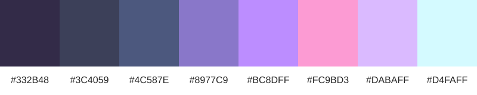

# Draft Color Palette

**Status: PROPOSED** 
**Periode dokumentasi: 11–17 September 2026**

Palet berikut mendokumentasikan hasil eksplorasi visual pada Week 3. Warna gelap dipilih sebagai dasar antarmuka monitoring, sedangkan variasi ungu, biru, dan pastel dipertimbangkan sebagai warna aksen. Palet ini belum menjadi design system final dan masih memerlukan persetujuan tim serta pengujian aksesibilitas.

| Token sementara | Nilai | Penggunaan yang diusulkan |
| --- | --- | --- |
| `dark-900` | `#332B48` | Latar utama dashboard |
| `dark-800` | `#3C4059` | Surface atau panel utama |
| `slate-600` | `#4C587E` | Border, elemen sekunder, atau data muted |
| `purple-500` | `#8977C9` | Aksen sekunder |
| `purple-400` | `#BC8DFF` | Aksen utama dan elemen interaktif |
| `pink-300` | `#FC9BD3` | Highlight atau perhatian non-kritis |
| `purple-200` | `#DABAFF` | Highlight lembut |
| `cyan-100` | `#D4FAFF` | Informasi berkontras terang |

Nama token dan penggunaan pada tabel merupakan **PROPOSED**, bukan keputusan final. Nilai warna berasal dari palet yang dicantumkan dalam laporan Week 3.

## Keputusan yang Masih Terbuka

- **TBD:** pasangan warna teks dan latar yang memenuhi kebutuhan kontras.
- **TBD:** pemetaan warna untuk status Sepi, Normal, dan Ramai.
- **TBD:** warna state komponen, termasuk hover, focus, disabled, success, warning, dan error.
- **TBD:** persetujuan palet sebagai baseline implementasi frontend.

Palet tidak boleh dianggap siap diimplementasikan sebelum pemetaan semantik dan pengujian kontras selesai.
