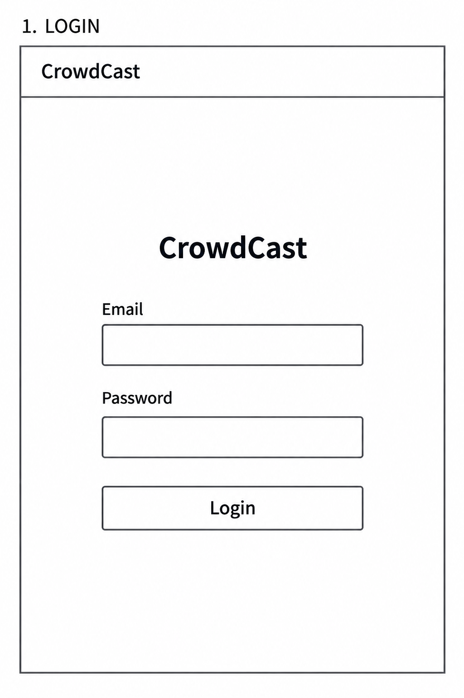
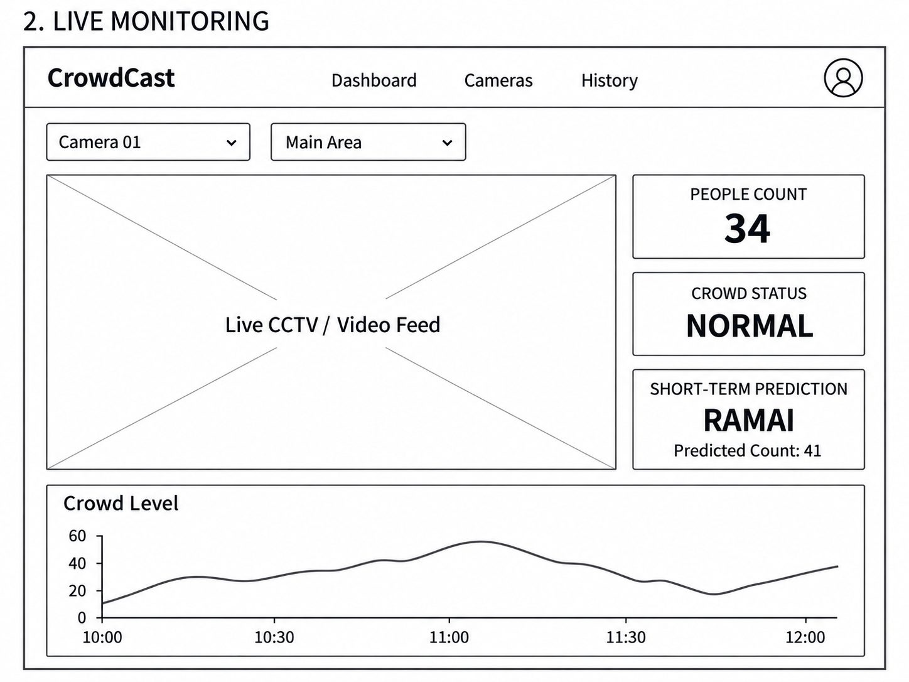
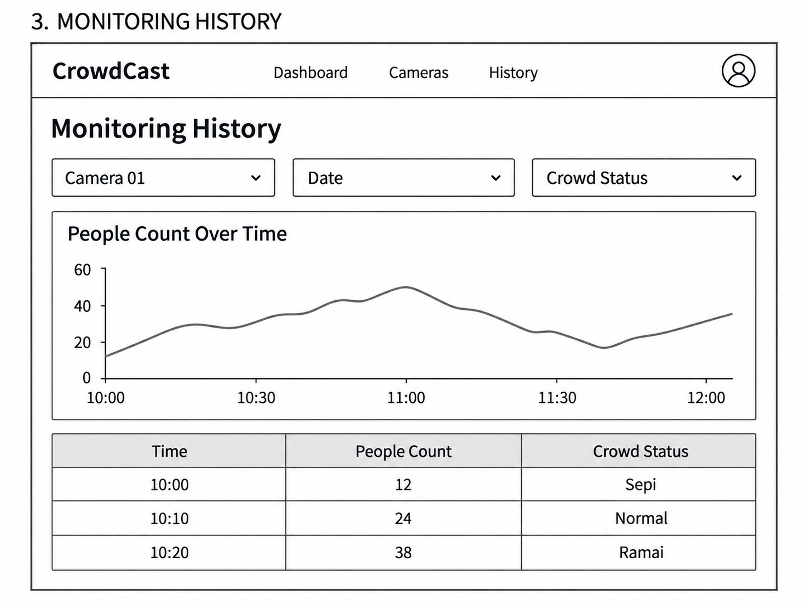

# CrowdCast

## Project Senior Project TI

**Departemen Teknologi Elektro dan Teknologi Informasi**  
Fakultas Teknik  
Universitas Gadjah Mada

## Anggota Kelompok 03 Labdas 1

- Rasyadwa Arsya Irnantyanto — 24/534174/TK/59283
- Ghaisan Rifqi Kamiel — 24/540091/TK/59899
- Raditya Azhar Ananta — 24/539913/TK/59881

---

## Nama Produk

**CrowdCast**

## Jenis Produk

Sistem digital untuk pemantauan dan prediksi kepadatan kerumunan berbasis video/CCTV dengan memanfaatkan jaringan komputer, komputasi awan, dan kecerdasan buatan. Informasi monitoring disajikan melalui dashboard berbasis web.

## Latar Belakang dan Permasalahan

Keramaian pada kampus, tempat wisata, pusat perbelanjaan, ruang publik, dan lokasi acara dapat berubah dalam waktu singkat. Jika tidak dipantau dengan baik, kondisi tersebut dapat menyebabkan antrean, menurunkan kenyamanan pengunjung, menghambat operasional, serta meningkatkan risiko keselamatan.

Meskipun banyak lokasi telah memiliki CCTV, pemanfaatannya masih bergantung pada pengamatan manual. Petugas harus memantau video secara terus-menerus untuk mengetahui kondisi suatu area. Cara ini kurang efisien dan belum memberikan informasi kuantitatif mengenai jumlah orang atau tingkat keramaian secara cepat. Sistem people counting sederhana juga umumnya hanya menunjukkan kondisi saat ini, sehingga pengelola belum dapat mengantisipasi peningkatan keramaian.

Berdasarkan permasalahan tersebut, dibutuhkan sistem yang dapat menganalisis video CCTV secara otomatis, menghitung jumlah orang, mengklasifikasikan kondisi area menjadi Sepi, Normal, atau Ramai, serta memberikan prediksi keramaian dalam beberapa menit ke depan. Pada tahap awal, sistem dikembangkan dan dijalankan secara lokal untuk mengurangi kebutuhan biaya cloud serta mempermudah proses pengujian menggunakan CCTV maupun recorded video.

## Ide Solusi

Solusi yang diusulkan adalah **CrowdCast**, yaitu sistem pemantauan keramaian berbasis kecerdasan buatan yang memproses video CCTV secara lokal pada komputer atau perangkat *edge*. Sistem menggunakan model YOLO untuk mendeteksi manusia dan ByteTrack untuk melacak objek antar-frame agar jumlah orang dapat dihitung dengan lebih stabil.

Jumlah orang yang terdeteksi pada area tertentu dianalisis menggunakan *region of interest* dan *rolling average*, kemudian diklasifikasikan menjadi tiga kondisi, yaitu Sepi, Normal, dan Ramai. Sistem juga menyimpan riwayat jumlah orang secara lokal dan menggunakannya untuk memperkirakan kondisi keramaian dalam 5, 15, dan 30 menit berikutnya.

Hasil analisis ditampilkan melalui *dashboard* lokal yang berisi jumlah orang, status keramaian, prediksi, tren perubahan, dan peringatan apabila area sedang atau diperkirakan menjadi ramai. Sistem dapat menerima CCTV secara langsung melalui RTSP maupun recorded video yang diputar sebagai simulasi aliran CCTV. Pada tahap pengembangan saat ini, video dan data analitik direncanakan diproses secara lokal sehingga kebutuhan layanan cloud dapat ditunda.

Rincian YOLO, ByteTrack, *region of interest*, *rolling average*, RTSP, serta prediksi 5, 15, dan 30 menit di atas dipertahankan dari rancangan Modul 1. Uraian ini merupakan rancangan produk, bukan laporan fitur yang sudah diimplementasikan atau hasil pengujian. Model prediksi, threshold kepadatan, database, framework frontend/backend, serta layanan cloud belum ditetapkan dalam halaman ini.

Pengembangan awal dilakukan secara **local-first** agar pengembangan dan integrasi komponen utama dapat dilakukan tanpa bergantung pada layanan cloud. Arsitektur tetap dirancang modular agar integrasi dan deployment cloud dapat dilakukan pada tahap pengembangan berikutnya. Komputasi awan tetap menjadi requirement produk akhir Senior Project, bersama jaringan komputer dan kecerdasan buatan. Live CCTV merupakan target ideal, sedangkan **recorded video merupakan fallback resmi** agar pengembangan dan demo tidak bergantung pada akses CCTV live.

## Analisis Kompetitor

Kompetitor CrowdCast dapat dibagi menjadi tiga kategori, yaitu pemantauan CCTV manual, sistem people counting sederhana, dan platform video surveillance berbasis AI seperti 3dEYE. Pemantauan manual bergantung pada perhatian petugas dan tidak menghasilkan analisis otomatis. Sistem people counting sederhana dapat menghitung jumlah orang, tetapi biasanya belum menyediakan prediksi keramaian atau rekomendasi tindakan operasional.

3dEYE memiliki fitur yang lebih luas, seperti pengelolaan banyak kamera, penyimpanan video, pelacakan objek, people counting, analitik okupansi, dan notifikasi keamanan. Namun, 3dEYE berfokus pada platform video surveillance berskala luas, sedangkan CrowdCast difokuskan pada pemantauan keramaian dan prediksi jangka pendek untuk satu lokasi dengan kebutuhan yang lebih sederhana.

Keunggulan yang dituju CrowdCast adalah pemrosesan lokal, kebutuhan infrastruktur yang lebih ringan, fokus pada klasifikasi dan prediksi keramaian, serta penyajian informasi yang mendukung keputusan operasional. Analisis ini merupakan perbandingan konseptual Modul 1, bukan hasil benchmark. Pengelolaan banyak lokasi belum menjadi fokus MVP. Pengembangan awal masih local-first sehingga akses jarak jauh dan skalabilitas cloud belum menjadi kemampuan tahap awal; integrasi cloud tetap direncanakan untuk memenuhi requirement akhir.

# Perancangan SDLC

Bagian berikut merupakan baseline perancangan Week 2 — Modul 2 SDLC & Git. Requirement dan jadwal menjelaskan target pengembangan, bukan status penyelesaian implementasi.

## Metodologi SDLC

### Metodologi yang Digunakan

**Agile**

### Alasan Pemilihan

Metodologi Agile dipilih karena pengembangan CrowdCast melibatkan beberapa komponen yang perlu dikembangkan, diuji, dan diintegrasikan secara bertahap, seperti computer vision, video processing, backend, jaringan komputer, komputasi awan, dan antarmuka pengguna. Agile memungkinkan tim melakukan pengembangan secara iteratif, mengevaluasi hasil pada setiap iterasi, serta menyesuaikan requirement berdasarkan hasil pengujian selama proses pengembangan.

## Tujuan Produk

CrowdCast bertujuan menyediakan sistem pemantauan tingkat kepadatan kerumunan dan prediksi kepadatan jangka pendek berbasis video/CCTV. Sistem memanfaatkan computer vision untuk mendeteksi orang dan menghasilkan informasi jumlah orang serta status Sepi, Normal, atau Ramai sehingga kondisi suatu area dapat dipantau dengan lebih mudah. Riwayat monitoring dan hasil prediksi disajikan melalui dashboard untuk membantu pengguna memahami perubahan kepadatan.

## Pengguna Potensial dan Kebutuhan

| Pengguna | Kebutuhan |
| --- | --- |
| Operator/Pengelola Area | Memantau kondisi kepadatan secara langsung, melihat jumlah orang, status kepadatan, prediksi, dan riwayat monitoring. |
| Administrator | Mengelola sumber camera/video, akun pengguna, serta konfigurasi sistem yang diperlukan. |

## Use Case Diagram

Representasi berikut menunjukkan hubungan actor dan use case utama CrowdCast.

<!-- Diagram visual use case dapat ditambahkan setelah aset tersedia di repository. -->

| Actor | Use Case |
| --- | --- |
| Operator | Login; View Live Monitoring; View Crowd Status; View Crowd Prediction; View Monitoring History. |
| Administrator | Login; View Monitoring History; Manage Cameras; Manage Users. |

Operator memantau kondisi area dan prediksi melalui dashboard. Administrator mengelola sumber video dan akun pengguna serta dapat melihat riwayat monitoring. Login merupakan kebutuhan autentikasi yang dirancang untuk kedua actor.

## Functional Requirements

| FR | Deskripsi |
| --- | --- |
| FR-01 | Sistem dapat menerima video dari sumber video/CCTV yang dikonfigurasi. |
| FR-02 | Sistem dapat mendeteksi orang pada video menggunakan computer vision. |
| FR-03 | Sistem dapat menghasilkan estimasi jumlah orang dari video. |
| FR-04 | Sistem dapat menentukan status kepadatan menjadi Sepi, Normal, atau Ramai. |
| FR-05 | Sistem dapat menampilkan kondisi kepadatan kepada pengguna. |
| FR-06 | Sistem dapat melakukan prediksi kepadatan jangka pendek berdasarkan data crowd. |
| FR-07 | Sistem dapat menampilkan hasil prediksi kepada pengguna. |
| FR-08 | Sistem dapat menyimpan data monitoring/history kepadatan. |
| FR-09 | Sistem dapat menampilkan riwayat kepadatan. |
| FR-10 | Administrator dapat mengelola sumber camera/video. |
| FR-11 | Pengguna yang memiliki hak akses dapat melakukan login. |
| FR-12 | Administrator dapat mengelola pengguna sesuai kebutuhan sistem. |

## Entity Relationship Diagram

Model data konseptual berikut menjadi baseline untuk perancangan penyimpanan. Pemilihan database dan detail implementasinya akan ditentukan pada tahap pengembangan.

<!-- Diagram visual ERD dapat ditambahkan setelah aset tersedia di repository. -->

| Entity | Atribut | Keterangan |
| --- | --- | --- |
| User | `user_id`, `name`, `email`, `password_hash`, `role` | Menyimpan akun dan peran pengguna; `user_id` merupakan primary key. |
| Camera | `camera_id`, `name`, `location`, `source`, `status` | Menyimpan konfigurasi sumber camera/video; `camera_id` merupakan primary key. |
| CrowdRecord | `record_id`, `camera_id`, `timestamp`, `people_count`, `crowd_status` | Menyimpan riwayat kepadatan; `record_id` merupakan primary key dan `camera_id` merupakan foreign key ke Camera. |
| Prediction | `prediction_id`, `camera_id`, `timestamp`, `predicted_count`, `predicted_status`, `prediction_horizon` | Menyimpan hasil prediksi; `prediction_id` merupakan primary key dan `camera_id` merupakan foreign key ke Camera. |

```text
Camera (1) ───── (N) CrowdRecord
Camera (1) ───── (N) Prediction
```

Satu Camera dapat memiliki banyak CrowdRecord dan Prediction. Setiap record monitoring dan prediksi mengacu pada satu Camera. Entity User menyimpan akun; relasi tambahan dengan entity lain belum ditetapkan pada baseline ini.

## Low-Fidelity Wireframe

Wireframe berikut memusatkan perhatian pada susunan informasi dan fungsi utama layar.

### 1. Login

Layar login menyediakan isian email, password, dan tombol masuk untuk pengguna yang memiliki hak akses.



### 2. Dashboard / Live Monitoring

Dashboard menampilkan identitas/lokasi camera, video, jumlah orang, status kepadatan, serta prediksi. Menu pengelolaan camera ditujukan untuk Administrator.



### 3. Monitoring History

Layar riwayat menampilkan perubahan kepadatan berdasarkan camera dan periode waktu, melalui grafik sederhana serta tabel monitoring.



## Gantt Chart

Jadwal berikut merupakan baseline 12 pertemuan yang dapat disesuaikan dengan hasil evaluasi setiap iterasi. Simbol **●** menandai pertemuan aktif untuk kegiatan tersebut, bukan kegiatan yang sudah selesai.

| Kegiatan | 1 | 2 | 3 | 4 | 5 | 6 | 7 | 8 | 9 | 10 | 11 | 12 |
| --- | --- | --- | --- | --- | --- | --- | --- | --- | --- | --- | --- | --- |
| Planning & Requirement | ● | ● | | | | | | | | | | |
| System Design | | ● | ● | | | | | | | | | |
| Video Pipeline | | | ● | ● | ● | | | | | | | |
| AI Development | | | ● | ● | ● | ● | | | | | | |
| Backend Development | | | | ● | ● | ● | ● | | | | | |
| Frontend Dashboard | | | | | ● | ● | ● | ● | | | | |
| System Integration | | | | | | | ● | ● | ● | | | |
| Testing | | | | | | | | ● | ● | ● | | |
| Cloud & Deployment | | | | | | | | | | ● | ● | |
| Final Testing & Documentation | | | | | | | | | | | ● | ● |

## Cara Kerja CrowdCast

```text
Video Source → Person Detection → People Counting → Crowd Status
→ Historical Data → Short-Term Prediction → Backend/API → Dashboard
```

Sumber video dapat berupa live CCTV atau recorded video. Hasil penghitungan dan klasifikasi disimpan sebagai riwayat dan digunakan untuk prediksi jangka pendek. Backend/API menyediakan informasi monitoring dan prediksi kepada dashboard. Komponen video/AI, backend, frontend, dan penyimpanan dirancang modular agar komunikasi jaringan serta integrasi cloud dapat dikembangkan bertahap.
